# HapticButton
Research on improvement on haptic button.

This project was done with advisory from professor [Geehyuk Lee](https://hcil.kaist.ac.kr/people/) from [KAIST HCI Lab](https://hcil.kaist.ac.kr/).  
It was an attempt to improve the [3D-press: haptic illusion](https://dl.acm.org/doi/abs/10.1145/1891903.1891931) by J. Kildal.  
  
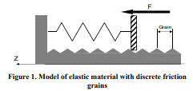  

The main focus of improvement was the discrete, rusty spring like feeling the baseline method had.
 Simple model from the baseline make the implementation that much simple and effective,
 but it also made the implementation to share the same universal feelings with less room of diversification.  
That is, even when different parameters (base frequency, grain intervals, randomness) changed, they still felt somewhat similar,
 although there still were some spectrum of different feelings.  
  
This writing is mostly from the interim report I wrote during the project:  
  
## 1.	Introduction  
In Johan Kildal’s research  of haptic illusion, virtual compliance on a rigid surface was achieved by
vibrotactile feedback that occurs according to the change of applied pressure. The feedback signal is
constructed with sinewave enveloped in inverse-sawtooth amplitude. The signal is actuated by electro-mechanical
transducer attached to the touch surface. Single feedback signal is fired when pressure increases or decreases for certain amount.
This system is implemented based on a simple physical model that portrays pressing an elastic object with granular disturbance.  

## 2.	Problem and Solutions  
Although Kildal’s implementation does a fair job of generating the illusion of compliance, **the perception on the
vibrotactile feedback lacks diversity**. That is, although several variations have been tried on parameters such as amplitude, 
grain numbers and etcetera, **perception space is limited or at least unexplored**.  
The goal of this research is to investigate ways to diversify the vibration and perception. 
Several variations of the vibrotactile feedback was tried in hopes of achieving distinctively different sensation. 
Below are the list of variations followed by their profile plot (X - time, Y - signal):  
- _
  #### a. Pressure-Amplitude relationship  
  - increasing - decreasing - fixed scaling for randomly selected - random scaling  
  #### b. Pressure-Frequency relationship  
  - increasing - decreasing - fixed scaling for randomly selected - random scaling  
  #### c. Different envelope shapes  
  - inverse sawtooth - sawtooth - sine - triangle  
  #### d. Different grain intervals  
  - range of grain intervals - randomly bigger/smaller grain intervals  
  #### e. Different pulse count  
  - fewer pulse count (shorter envelope) - more pulse count (longer envelope)  
  #### f. Force gradient-Amplitude relationship on recorded sound  
  - A wave table of recorded sound is played in a loop, and the magnitude of force change determines the amplitude of the vibration. 
  This is based on the fact the intensity of vibration is somewhat proportional to the traversing speed.
  The recorded sound is low-pass filtered beforehand.
The plots below is recorded directly from microcontroller output after low-pass filter.  
  
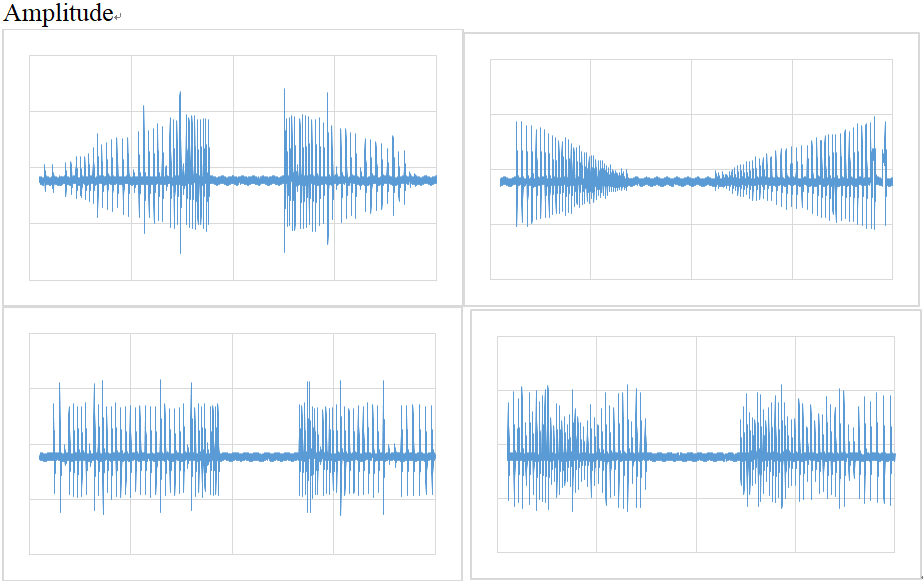  
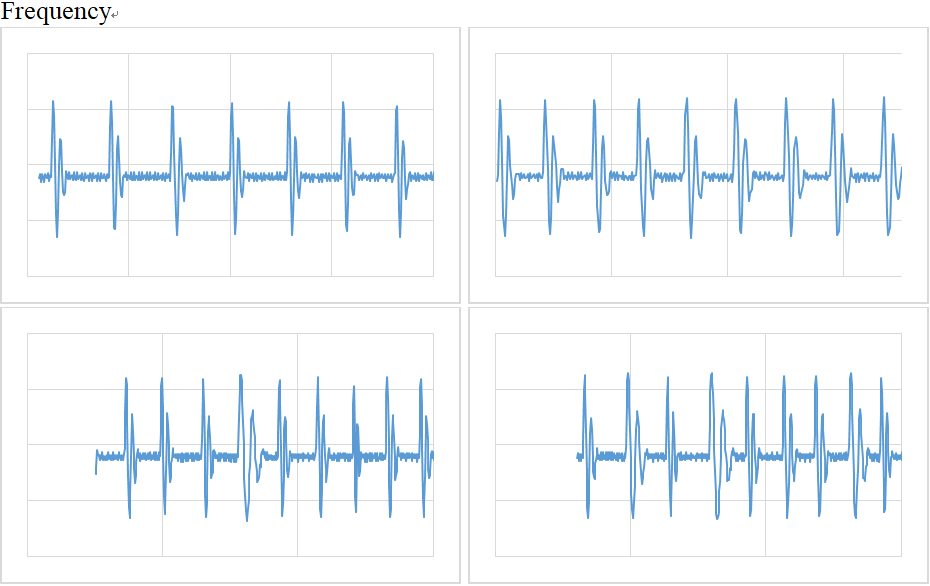  
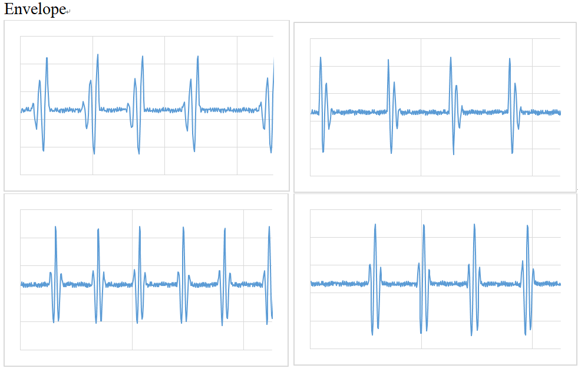  
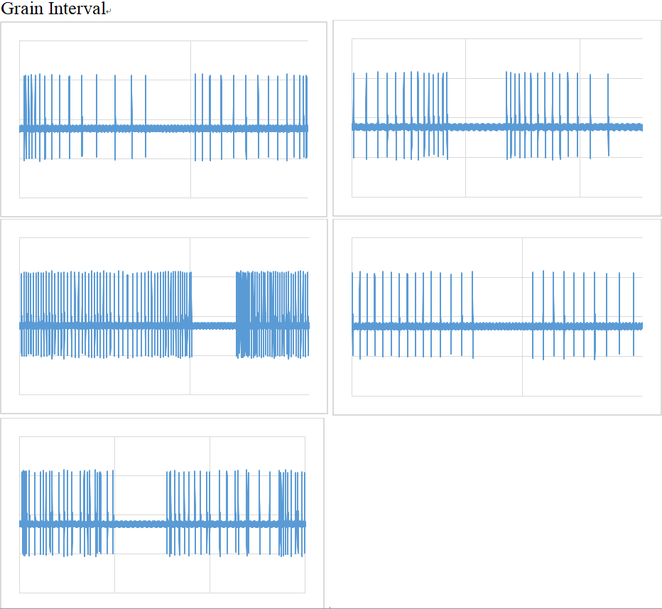  
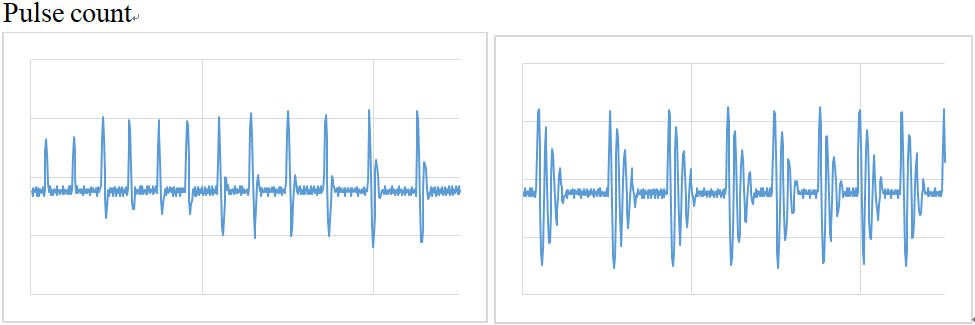  
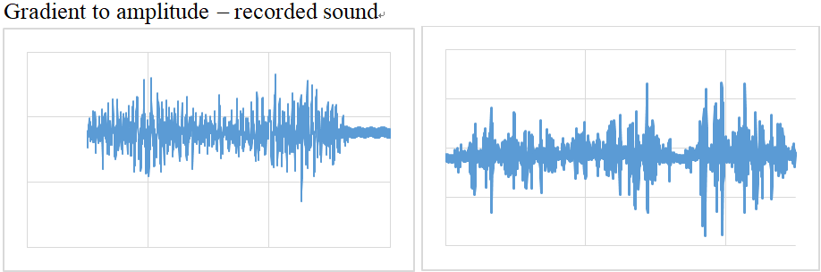  
  
## 3.	Implementation detail  
The implementation is done on a system as shown below.  

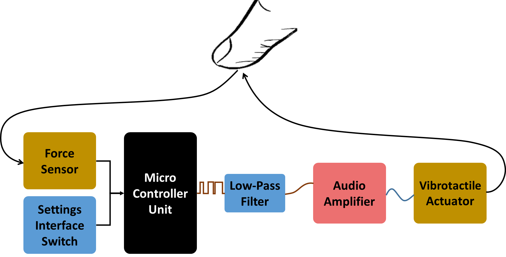    

Arduino with ATmega328p chip was used for earlier stage, but was ported over to STM32 chip due to its computational limits and memory limits. The algorithm can be broken down to two loops that runs in almost time shared manner. The main loop and timer overflow loop.   

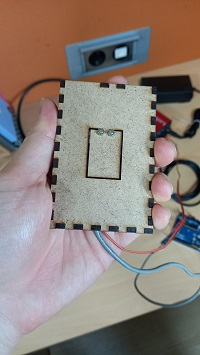

> The divce

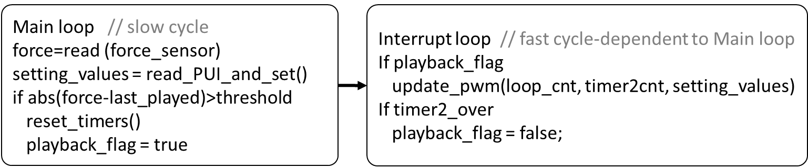   
> Internal workings diagram 

In the main loop, force value and setting switches are read. According to the force change, 
if sufficient amount of change was made, signal playback flag is set and timer is reset.  
There are two timers being used, a timer for PWM cycle and another one for the signal envelope. 
Timer interrupt loop is only set for PWM cycle timer. Once every PWM cycle finishes, 
next PWM intensity is calculated and set in this interrupt. 
If the playback flag is set, next intensity is calculated from sine lookup table and the other timer counter value. 
Calling a complicated math function causes inaccurate frequency output so it should be used with caution.
The other timer determines when the playback flag should be reset. At certain value, it will reset the flag, 
ending a single grain of vibration.  
The playback flag is set if the force input increases or decreases more than certain amount from the last played value.  
Exceptionally for gradient to amplitude implementation, playback flag is not required. 
The recorded sound is stored as lookup table and is being played in loop constantly. 
When setting PWM intensity, the force difference compared to last reading is used as scaler. 
The recorded sound has been edited to be symmetrical in order to prevent ‘knocking’ of the sound when sound signal meets an abrupt change. 
In the plots below, first signal makes knocking sound at around 9000, and the right one does not.  
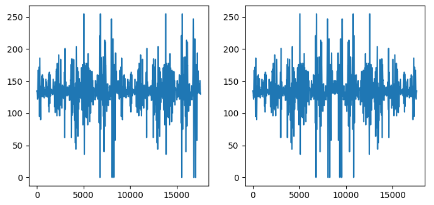  

## 4.	Results  
Some difference in perception was found along a few variations.  
-	Vibration duration or pulse count per envelope  
 The longer the duration went on, the more elastic it felt. But at certain point the duration became too much.  
-	Grain interval  
 The longer it took for next grain, it felt more stiff  
-	Envelope shape  
 Sine and triangle envelope gave smoother sensation  
-	Other variations did give different feeling, but the difference couldn’t be specified easily.  
-	Randomness in the parameters didn’t contribute much to difference in perception.  
-	The recorded sound gave the most distinctively different perception of texture compared to the sinewave based signal.  
  
## 5.	Things I Learned  
-	How to read MCU datasheets (ATmega328/STM32)  
-	Better understanding of how microcontroller operates.  
	Timers, SFR, PWM Interrupts, Hardware Abstract Library  
-	Low-pass filters in practice  
-	Cost/strength of overflows of datatypes  
-	Reading scientific papers  
  
## 6.	Related papers and their contribution to this research  
 -	Yon Visell et al. A Device and Method for Multimodal Haptic Rendering of Volumetric Stiffness  
    - The vibrotactile implementation in this paper used pink noise for dynamic feedback. The detail of how the applied force was used for generating vibration was shown in block diagram which I don’t know how to implement at the moment  
 -	Paul Stohmeier et al. bARefoot: Generating Virtual Materials using Motion Coupled Vibration in Shoes  
    - This research has a good review of other researches using the baseline method, and has developed a tool to experiment with many different parameters.  
 -	Seongkook Heo, Geehyuk Lee. Creating Haptic Illusion of Compliance for Tangential Force Input using Vibrotactile Actuator  
    - The vibration signal in this study is the same with the vanilla Kildal method, But the grain interval design and the illustration regarding it is very useful. Both in understanding plus making jitter free code.  
 -	Teemu Ahmaniemi. Effect of Dynamic Vibrotactile Feedback on the Control of Isometric Finger Force  
    - The idea of amplitude and frequency variation incurred by applied pressure.  
 -	Teemu Ahmaniemi. Dynamic Tactile Feedback in Human Computer Interaction  
    - This study relates motion of device to vibrotactile feedback, but still relies on similar vibration signal generation. The idea I took away from this paper is to use different envelopes. And the ‘study V’ reinforced the idea of dynamic amplitude/frequency feedback.  
 -	Paul Strohmeier et al. From Pulse Trains to “Coloring with Vibrations”: Motion Mappings for Mid-Air Haptic Textures.  
    - This paper tries something similar to Teemu’s study and works on 3d motion to vibrotactile feedback. The signal generation is not really specified. The vibration signal is most likely grain like vibration (hence the name Pulse Train) or since it references to K. J. Kuchenbcker, uses linear prediction in time series to generate vibration.  
 -	Sunjun Kim and Geehyuk Lee. Haptic Feedback Design for a Virtual Button Along Force-Displacement Curves.  
    - This paper uses almost the same vibration signal as the Kildal’s method. But the applicational idea to simulate buttons is interesting.  
 -	Johan Kildal, Kooboh: Variable Tangible Properties in a Handheld Haptic-Illusion Box  
    - Nothing specially added to ideas.  
 -	Chi-Hsia Lai Matti Niinimaki, Johan Kildal et al. Perceived Physicality in Audio-Enhanced Force Input  
    - This paper doesn’t work with tactile actuator but with audio. Still the vibration signal is similar. But interestingly, they seem to have used real sound of sand, and also applied origianl Kildal’s method to simulate bubble wrap. This gave me idea of playing sounds of plastic bags or simulating page riffling of a book.  
 -	Hwan Kim et al. HapThimble: A Wearable Haptic Device towards Usable Virtual Touch Screen  
    - The vibration signal is quite similar with the button simulations, only significant difference is it being wearable device.  
  

